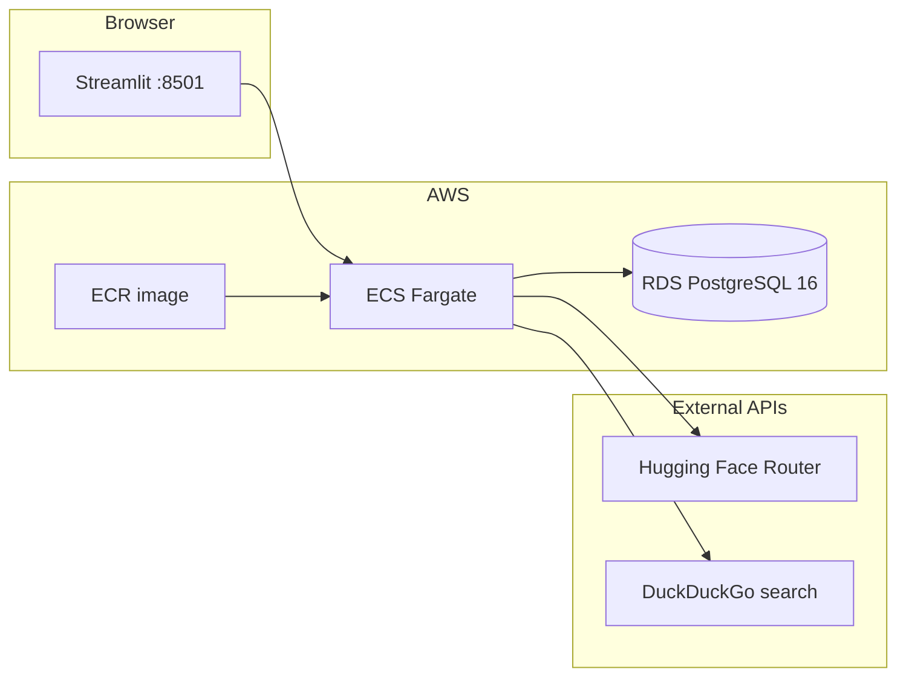

# Betr Eats

A mostly non vibe coded app (other than the boring stuff like this README!). A fun personal project that is helping me lose weight and allowed me to write a full stack agentic application.

Betr Eats is a personal nutrition and weight-loss companion. You log meals, weight, exercise, and goals in PostgreSQL, chat with an AI assistant to estimate calories and record entries, and generate LLM-written progress summaries over flexible time ranges.

The app is a **Streamlit** UI backed by **PostgreSQL** and an **OpenAI Agents**–based assistant that calls tools (web search, database writes/reads). Inference runs through the **Hugging Face Inference Router** (OpenAI-compatible API). Production runs on **AWS**: **RDS PostgreSQL**, **ECS Fargate** for the app, **ECR** for container images, provisioned with **Terraform**.

## Features

| Area | What it does |
|------|----------------|
| **Chat** | Natural-language logging and Q&A (e.g. “I had a cheeseburger and fries—log it”) |
| **Add / Edit** | Manual CRUD for meals, weight, exercise, and goals |
| **Reports** | AI summaries for today, week, month, 3/6 months, or year |
| **Sidebar** | Clear chat UI and agent conversation history (SQLite session) |

## Architecture



**Local development** replaces ECS/RDS with Docker Postgres (`database/dev`) and runs Streamlit on your machine.

## Repository layout

```
betr-eats/
├── app/                    # Streamlit UI (main.py, tabs, record forms)
├── src/betr_eats/
│   ├── agents/             # MainAgent, tools, prompts
│   ├── db/                 # SQLAlchemy models and Connection
│   ├── helpers/            # Hugging Face Model client
│   └── reports/            # Period summaries (today → year)
├── database/dev/           # docker-compose Postgres + init.sql
├── infra/                  # Terraform (VPC, RDS, ECS, schema apply)
├── Dockerfile              # Production Streamlit image
├── Makefile                # ECR build, push, local container run
└── main.py                 # CLI script to exercise the agent without UI
```

## AI agent

The **Betr Eats** agent (`MainAgent`) uses the [OpenAI Agents SDK](https://github.com/openai/openai-agents-python) with a persistent **SQLite** session (`session_id="betr-eats"`) so multi-turn chat retains context until you clear it from the sidebar.

**Model:** `HF_MODEL` and `HF_TOKEN` configure an `AsyncOpenAI` client pointed at `https://router.huggingface.co/v1`.

**Tools:**

| Tool | Purpose |
|------|---------|
| `search_calorie_count` | DuckDuckGo text search to estimate calories from a meal description |
| `write_meal_log` | Insert a meal (`breakfast`, `lunch`, `dinner`, `snack`, `other`) for today |
| `get_meal_log_for_day` | List meals for a date (`YYYY-MM-DD`) |
| `write_weight_log` | Record today’s weight in pounds |

The system prompt encourages supportive feedback and instructs the model when to search, log, or fetch history. Reports use the same `Model` helper with direct completion calls (no agent loop).

**Try the agent from the CLI** (after installing deps and setting `.env`):

```bash
uv run python main.py
```

Edit the `query` in `main.py` to test different prompts.

## Prerequisites

- **Python 3.14+** and [uv](https://docs.astral.sh/uv/) (or pip)
- **Docker** (local Postgres and/or containerized app)
- **Hugging Face token** with access to your chosen `HF_MODEL`
- **AWS CLI** configured (for ECR push and Terraform deploy)
- **Terraform** ≥ 1.x (for cloud infra)

## Configuration

Copy the example env file and fill in secrets:

```bash
cp .env.example .env
```

| Variable | Description |
|----------|-------------|
| `HF_MODEL` | Hugging Face model ID (e.g. `meta-llama/Meta-Llama-3-8B-Instruct`) |
| `HF_TOKEN` | Hugging Face API token |
| `POSTGRES_USER` | Database user |
| `POSTGRES_PASSWORD` | Database password |
| `POSTGRES_DB` | Database name |
| `POSTGRES_HOST` | Hostname (`localhost` for local compose, RDS endpoint in prod) |
| `POSTGRES_PORT` | Port (default `5432`) |

Database access in code uses `Connection()`, which loads **`.env.dev`** by default. For local work, either copy `.env` to `.env.dev` or export the same variables in your shell:

```bash
cp .env .env.dev
```

The Streamlit tabs read `HF_MODEL` from the process environment (including a root `.env` when you use `--env-file` or `load_dotenv` in scripts).

## Local development

### 1. Install the package

```bash
make install
# or: uv build && uv pip install -e .
```

### 2. Start PostgreSQL

```bash
cd database/dev
docker compose up -d
```

Schema is applied from `database/dev/init.sql` on first boot (`meals`, `weight`, `goals`, `exercise`).

Point `.env` / `.env.dev` at the local instance:

```env
POSTGRES_HOST=localhost
POSTGRES_PORT=5432
POSTGRES_USER=postgres
POSTGRES_PASSWORD=postgres
POSTGRES_DB=postgres
```

### 3. Run the Streamlit app

```bash
cd app
streamlit run main.py
```

Open [http://localhost:8501](http://localhost:8501).

### 4. Optional: run via Docker (same image as production)

Build and run with your `.env` (requires ECR login if using the Makefile image name):

```bash
make build
make local_run
```

`local_run` maps port **8501** and passes `--env-file .env`.

## Deploy to AWS

### Build and push the image

The Makefile tags and pushes to ECR in **us-east-1** as `betr-eats:latest`:

```bash
make create_repo    # once: create ECR repo and docker login
make build_and_push # build linux/amd64, auth, push
```

Ensure the image URI in `infra/ecs.tf` matches your AWS account’s ECR repository (or update Terraform after first push).

### Provision infrastructure

```bash
cd infra
cp terraform.tfvars.example terraform.tfvars
# Edit: hf_token, CIDR restrictions, publicly_accessible, etc.
terraform init
terraform apply
```

Terraform typically creates:

- **VPC** (optional) with public subnets when `publicly_accessible = true`
- **RDS PostgreSQL 16** (`db.t4g.micro` by default), encrypted storage
- **Security groups** for Postgres and Streamlit (port 8501)
- **ECS Fargate** cluster and service running the Streamlit container
- **CloudWatch** log group for ECS tasks
- **Schema apply** via `infra/scripts/apply_schema.sh` and `infra/init.sql`

Useful outputs after apply:

```bash
terraform output db_endpoint
terraform output -raw connection_string   # sensitive
terraform output streamlit_public_ip_command
```

Get the running app URL:

```bash
eval $(terraform output -raw streamlit_public_ip_command)
# Prints public IP and http://<ip>:8501
```

Set `hf_token` in `terraform.tfvars` (or inject later) so ECS tasks receive `HF_TOKEN`. Restrict `allowed_cidr_blocks` and `streamlit_allowed_cidr_blocks` before exposing production data.

For stricter production setups, set `publicly_accessible = false`, use private subnets, and front the service with a load balancer or VPN (not included in this repo’s defaults).

## Using the app

1. **Chat** — Describe what you ate or ask for a day’s log; the agent searches for calories when needed and writes to Postgres.
2. **Add** — Enter meals, weight, exercise, or goals manually.
3. **Edit** — Update or remove existing records.
4. **Reports** — Pick a period and end date, then **Generate summary** for an LLM narrative over your data.
5. **Clear chat** (sidebar) — Resets the UI messages and the agent’s SQLite session.

Example chat prompts:

- “I had oatmeal and a banana for breakfast. Log it.”
- “What did I eat on 2026-05-21?”
- “Log my weight as 180.5 lbs.”

## Database schema

Tables: `meals`, `weight`, `goals`, `exercise` (see `infra/init.sql` / `database/dev/init.sql`). Terraform reapplies schema on first create when `meals` is missing; existing databases are left unchanged.

## Security notes

- Do not commit `.env`, `terraform.tfvars`, or Terraform state with real secrets.
- Default Terraform variables allow broad CIDR access (`0.0.0.0/0`) for development—tighten for production.
- RDS and ECS task definitions contain sensitive values; use AWS Secrets Manager or SSM for hardened deployments.
